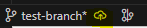

<font size="5"> **Git** </font>

<font size="4"> **Git commands** </font>

---

<!-- TOC tocDepth:2..3 chapterDepth:2..6 -->

- [1. Create, change and publish branches](#1-create-change-and-publish-branches)
  - [1.1. GitHub Desktop (recommended)](#11-github-desktop-recommended)
  - [1.1. VSCode (recommended)](#11-vscode-recommended)
  - [1.2. Git console](#12-git-console)
- [2. Update and publish changes](#2-update-and-publish-changes)
  - [2.1. VSCode](#21-vscode)
  - [2.2. Git console (recommended)](#22-git-console-recommended)
- [3. Merge branches (GitHub)](#3-merge-branches-github)
- [4. Appendix](#4-appendix)

<!-- /TOC -->

---

## 1. Create, change and publish branches

### 1.1. GitHub Desktop (recommended)

I havent used it yet but I know it is very powerful

### 1.2. VSCode (recommended)

Some commands can be executed much more conveniently with VSCode (especially creating a branch, switching between branches and publishing branches). To do this, click on the bottom left of the VSCode.


After clicking on it, we can:

- Create branch: "Create new branch".
- Change branch: Selecting the branch you want to move to from the drop-down menu.

> [!NOTE]
> The names of the branches, by convention, are in lower case and hyphenated.


- Publish branch: click on the cloud icon that appears in the bottom right corner just after creating it.


### 1.2. Git console

- Create new branch:
> [!NOTE]
> The names of the branches, by convention, are in lower case and hyphenated.

```bash
git checkout -b ＜new-branch＞
```

- Move to another branch

```bash
git checkout ＜existing-branch＞
```

## 2. Update and publish changes

### 2.1. VSCode

1. Make changes to your files in Visual Studio Code.

2. Click the Source Control icon in the sidebar to open the Source Control view.

3. Review your changes in the ``Changes`` section.

4. Click the ➕ button next to a file to stage the changes.

5. Enter a commit message in the text box above the file list.

> [!IMPORTANT]
> Always put a descriptive commit message about what you are uploading.

6. Click on the checkmark ✔️ to commit the changes.

7. Click the ellipsis button (...) in the Source Control view.

8. Choose ``Publish Branch`` if you have not yet uploaded any commits to your current branch.

9. Choose ``Push`` to upload your local commits to the remote repository.

10. Choose ``Pull`` to get the latest changes from the remote repository and merge them into your local branch.

### 2.2. Git console (recommended)

Follow the following command sequence:

```bash
git add <file-to-commit>

 To add all files
git add .

 Checking files to be added
git status

git commit -m "Commit description"

git push
```

> [!NOTE]
> Commit messages, by convention, are written in standard form (capital letters, spaces, etc.) and in English.

To update changes to a local branch (i.e. update the information in the local repository):

```bash
git pull
```

## 3. Merge branches (GitHub)

This is easily made in GitHub.

Then, in [GitHub](https://github.com) we'll see a popup that says `Create merge request`. Click on it, put comments and reviewer if needed, and create PR (Pull Request).

## 4. Appendix

In the console you can type `git --help` to see all the commands.
