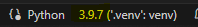

 **Python** 

 **VSC Configuration** 

<!-- TOC tocDepth:2..3 chapterDepth:2..6 -->

- [1. Introduction](#1-introduction)
- [2. Installing Python Extensions in VSC](#2-installing-python-extensions-in-vsc)
- [3. Linters and Formatters Configuration](#3-linters-and-formatters-configuration)
- [4. Code Formatting](#4-code-formatting)
- [5. Choosing Python Version](#5-choosing-python-version)

<!-- /TOC -->

## 1. Introduction

VSC is a very powerful code editor with very good operability with Git and GitHub. **It is recommended to use it instead of spyder.**

## 2. Installing Python Extensions in VSC

It is recommended, as a minimum, to install the following extensions:

- **Python**: Official Python extension for Visual Studio Code.
- **autopep8**: Keeps Python code conforming to PEP 8 style.
- **flake8**: Code analysis tool to verify compliance with PEP 8 and other guidelines.
- **isort**: Utility that sorts Python imports in an organised manner.
- **Jupyter**: Extension for working with Jupyter notebooks.
- **markdown all in one**: to work with .md files in an efficient way.

NOTE: It may be necessary to restart VSC after installing an extension.

## 3. Linters and Formatters Configuration

Customise the linting and formatting rules to suit your preferences. Access these settings from `File > Preferences > Settings`.

For example, if you want to set the maximum character limit per line in flake8, search for "Flake8 Args" and add the option `--max-line-length=120`.

> [!WARNING]
> It is recommended not to change these settings too much so as not to have the code too different from your peers.

## 4. Code Formatting

Keep your code clean and organised with ease. Use the keyboard shortcut `Shift + Alt + F` to automatically format your code in Visual Studio Code. The first time you do this, VSC will give you the option to select a default formatter.

It is recommended to choose `autopep8` for less aggressive formatting (`Black Formatter` is much stronger).

## 5. Choosing Python Version

In the lower right corner we can choose the version of Python (from those we have installed) with which to run the file, as shown in the following image:

Personally, I got a few errors when starting to work with Python 3.12 (especially related to installing dependencies). That's why I installed Python 3.9.7.

Generally, when working we will use a virtual environment (see "Virtual environment configuration")
