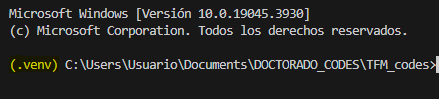
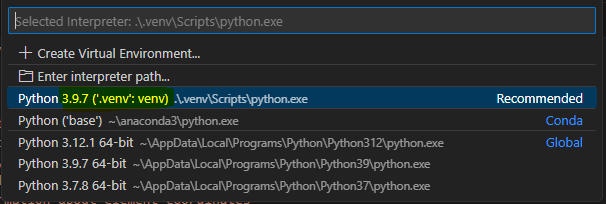

****
<font size="5"> **Python** </font>

<font size="4"> **Virtual Environment Configuration** </font>

<!-- TOC tocDepth:2..3 chapterDepth:2..6 -->

- [1. Introduction](#1-introduction)
- [2. Creating a Virtual Environment](#2-creating-a-virtual-environment)
- [3. Installing packages](#3-installing-packages)
- [4. Usage in Visual Studio Code](#4-usage-in-visual-studio-code)

<!-- /TOC -->

## 1. Introduction

Python virtual environments are fundamental tools for managing project dependencies in isolation, allowing the installation and update of project-specific libraries without interfering with other projects. This is crucial when working on multiple projects that may require different versions of the same libraries.

## 2. Creating a Virtual Environment

To create a virtual environment, you can use Python's built-in `venv` tool. Open a terminal in your project directory and run the following command:

``` bash
python -m venv .venv
```

> [!WARNING]
> The version you create the environment with will be the version of python you use for that project, e.g.:
>
> ``` bash
> python3.9.1 -m venv .venv
> ```
>
> ``` bash
> python3.7.3 -m venv .venv
> ```

This command will generate a directory called .venv which will contain an isolated virtual environment with its own Python and pip installation.

After creating the virtual environment, you must activate it before you can start working on your project. The way to activate the virtual environment depends on the operating system:

On Unix or MacOS systems:

``` bash
source .venv/bin/activate
```

On Windows systems:

``` bash
.venv/Scripts/activate
```

When the virtual environment is activated, the terminal prompt will change, showing the name of the current virtual environment.



## 3. Installing packages

To install the dependencies, run `pip install -r requirements.txt`.

NOTE: With Python version 3.12 I have been getting errors when doing this; however, I usually work with 3.9.7.

NOTE 2: Install requirements with the venv activated

## 4. Usage in Visual Studio Code

VSC will automatically detect the active virtual environment. However, you can verify or change it by selecting the Python interpreter in the bottom right corner of the VSC window.

In the following image you can see that I have 3 versions of Python installed (3.12.1, 3.9.7 and 3.7.8). I select as interpreter the 3.9.7 **from the virtual environment**.



If it says `Microsof Store` or anything else, you are not using the virtual environment you created, so the libraries or python version may be different and give conflicts both when running and debugging your code.
